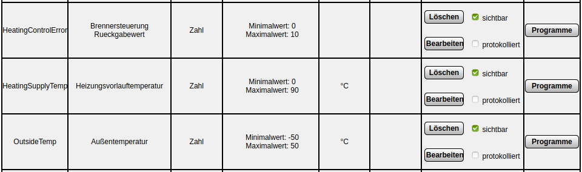

# 2001 - Homematic CCU

This module is meant to calculate the heating supply temperature on basis of the outside temperatur and the radiator valve state.

## Introduction

The [HomeMatic system of eQ-3](https://www.eq-3.com/products/homematic.html) provides radiator thermostats and many other devices.
Furthermore a CCU (Central Control Unit) can be used to administrate and control the devices.
On the CCU rules and scripts can automate the functionality.
This is where the heating supply temperature is calculated and sent to the hardware module.

### Preliminaries

* Radiator Thermostats installed and working on any radiator.
* CCU installed and working. It has been tested with [RaspberryMatic CCU](https://raspberrymatic.de/) which is based on a Raspberry Pi 2.
* [CUx-Daemon](https://www.homematic-inside.de/go/cuxd) installed and working on the CCU.
* Outside Temperatur stored on the CCU in a variable and updated regularly like described [here](../../10xx_weather/README.md)

## Setup

### Setup variables

In the Web UI of the CCU goto *Preferences* → *System variables* and click *New* to create new variables.
Create the following variables:

* Name=*OutsideTemp*, Description=*Outside temperature*, Type=*Number*, Minimum=*-50*, Maximum=*50*, Unit=*°C*, Channel=*without*, Visibility=*True*
* Name=*HeatingSupplyTemp*, Description=*Heating supply temperature*, Type=*Number*, Minimum=*0*, Maximum=*90*, Unit=*°C*, Channel=*without*, Visibility=*True*
* Name=*HeatingControlError*, Description=*Hardware module error value*, Type=*Number*, Minimum=*0*, Maximum=*10*, Unit=**, Channel=*without*, Visibility=*True*

### Setup rules

In the Web UI of the CCU goto *Programs and Connections* → *Programs and Direct Connections* and click *New* to create program.
Create the programs that are described in the following sections.

#### Update HeatingSupplyTemp

This rule takes the OutsideTemp variable and all radiator thermostat valve states to calculate the heating supply temperature according to the [heating function](https://de.wikipedia.org/wiki/Heizkurve).

* Name: *Update HeatingSupplyTemp*
* Condition: If
    * Device Radiator Thermostat at Valve position <10% trigger on change OR
    * Device Radiator Thermostat at Valve position from 10% to <70% trigger on change OR
    * Device Radiator Thermostat at Valve position from 70% to <90% trigger on change OR
    * Device Radiator Thermostat at Valve position ≥90% trigger on change
    * Repeat this for all Radiator Thermostats you have, all connected with disjucntions (OR)
* Activity: Then
    * End all running delays prior to execution
    * Select execute script immediately and copy the content of the rule_update.txt file as script. The constants can stay as they are and should only be updated if realy needed. This might be necessary if the calculated heating supply temperatures turn out to not be high enough to heat up your appartement/house, either because the radiators are too small or the insulation is too weak.

#### Send HeatingSupplyTemp

This rule claculates a value from the HeatingSupplyTemp and sends it to the Hardware module.

* Name: *Send HeatingSupplyTemp*
* Condition: If
    * System value HeatingSupplyTemp ≥ 0.00°C trigger on update
* Activity: Then
    * End all running delays prior to execution
    * Select execute script immediately and copy the content of the rule_send.txt file as script.
        * The constants have to be set as they have been figured out in the calibration of the hardware module.
        * All URLs have to be adapted as needed by the hardware module. Concatenate strings with #.
    * Select Device *CUxD_EXEC:1* immediately *button press short*

#### Store HeatingController ErrorCode

This rule stores the return value from wget that was used to send the HeatingSupplyTemp to the hardware module.

* Name: *Store HeatingController ErrorCode*
* Condition: If
    * Select Device *CUxD_EXEC:1* *CMD_RETS* value = 0.00 trigger on update OR
    * Select Device *CUxD_EXEC:1* *CMD_RETS* value ≠ 0.00 trigger on update OR
    * Select Device *CUxD_EXEC:1* on *button press short*
* Activity: Then
    * End all running delays prior to execution
    * Select execute script immediately and copy the content of the rule_store.txt file as script.
    * Optionally select *BidCoS-RF:1* immediately *button press short* to be able to react on the update from externally.

According to [wget man page](https://linux.die.net/man/1/wget) the exit status code 0 describes that no errors have occured.
All other values describe an error.