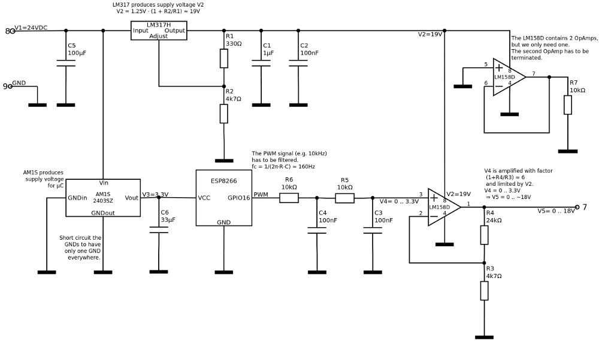
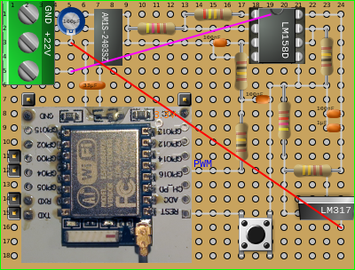
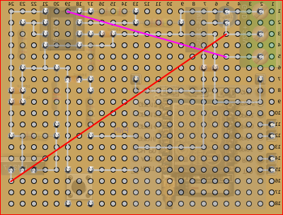
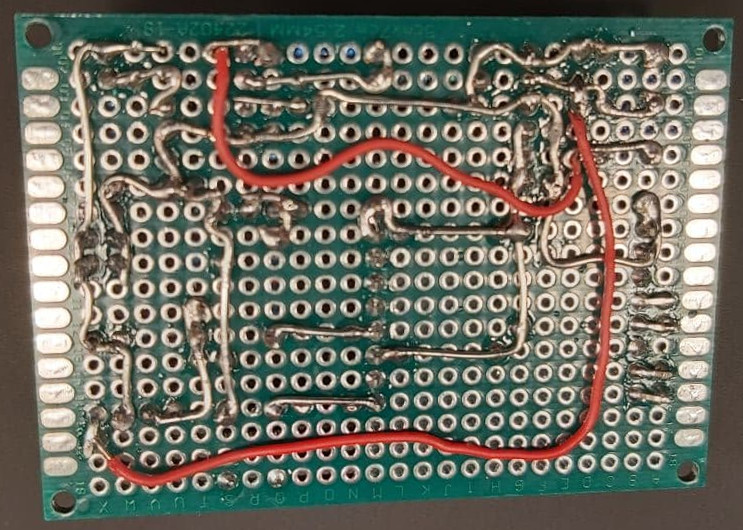
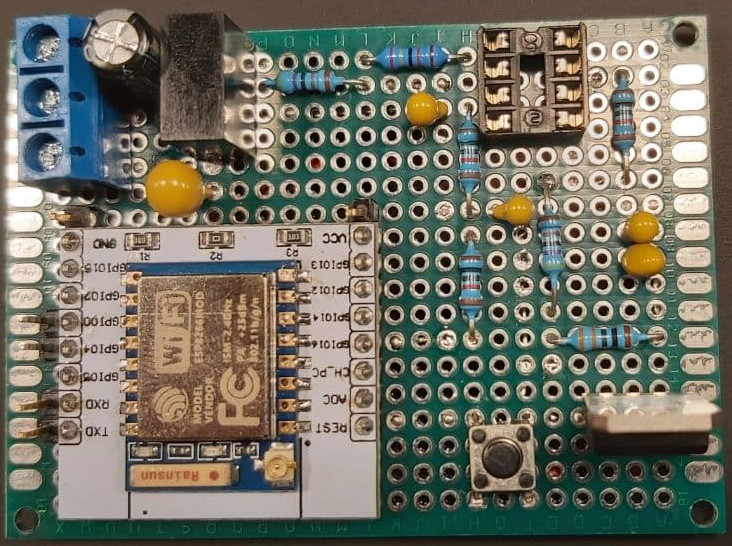
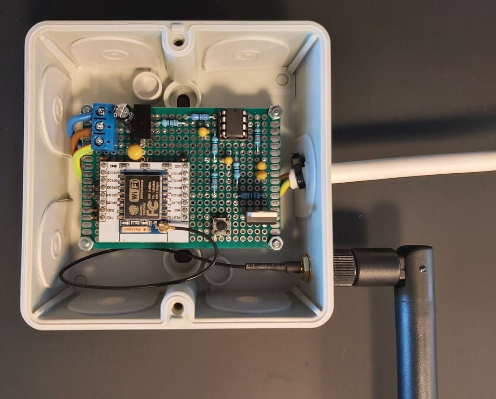
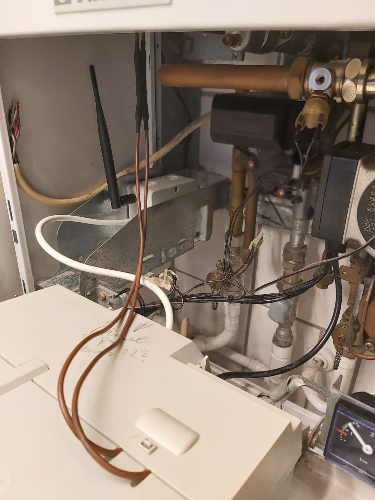

# 3001 - Vaillant 789 interface

This hardware module is meant to control Vaillant central-heating boilers with 789-interface.

# Introduction

The Vaillant 789-interface is a propretary interface to connect a Vaillant room thermostat to the central-heating boiler.
Therewith the heating supply temperature can be controlled.

## 789-Interface

The 789-interface consists of the three connectors 7, 8 and 9, which are used as described below:

* 7 - Voltage divider, return channel, 0-18VDC correspond to heating supply temperature 0-80°C
* 8 - 24VDC supply voltage
* 9 - GND

# Software

As software [Tasmota](https://tasmota.github.io/docs/) is used with version 8.5.0 or higher.

# Hardware

The hardware can be build as described in the below sections.

## Wiring Scheme

The wiring scheme has been created with [Dia Diagram Editor](http://dia-installer.de/).

## Board Assembly

The bread board has been planned with [Black Board by Matthias Püski](https://github.com/mpue/blackboard).

Find a list of needed parts below:

* Connecting terminal block triple
* C1 - 1µF/
* C2 - 100nF
* C3 - 100nF
* C4 - 100nF
* C5 - 100µF
* C6 - 33µF
* R1 - 330Ω
* R2 - 4k7Ω
* R3 - 4k7Ω
* R4 - 24kΩ
* R5 - 10kΩ
* R6 - 10kΩ
* R7 - 10kΩ
* Hookup wire
* Dual Pin - RX/TX
* Single Pin - GND
* Single Pin - VCC
* Dual Pin - GPIO0/GPIO4
* ESP-8266/ESP-7
* µC mounting board for ESP-7 incl. Pins
* Hole matrix board 18x24
* Junction box
* Spacer bolt M2x8mm incl. screws and/or nuts
* DCDC converter AM1S-2403SZ
* Adjustable voltage regulator LM317-220 Dual Gauge
* Operational amplifier LM358 DIP
* IC Socket 8-pin
* Reset button
* WLAN antenna

First the wires on the back have to installed. Make sure not to fill the holes with solder, where you want to insert the parts.

After that install the parts on the front while soldering from the back.

Use the spacer bolts to install the board into the junction box. Drill holes for the spacer bolt and the WLAN antenna beforehand.

Disconnect any room thermostat and connect the appliance cable to the 789-interface on the Vaillant central-heating boiler. Make sure to note down the colors of the room thermostat cable to be able to restore the default setup. There is enough space in the heating to put the box. 

