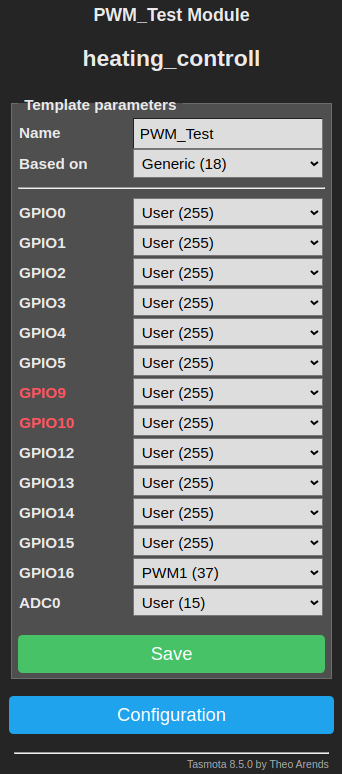
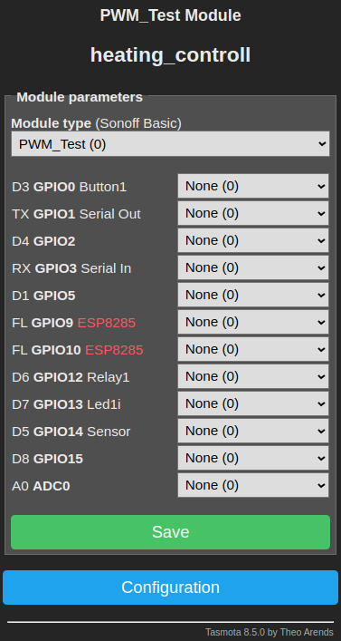

# 3001 - Vaillant 789 interface

This hardware module is meant to control Vaillant central-heating boilers with 789-interface.

# Introduction

The Vaillant 789-interface is a propretary analog interface to connect a Vaillant room thermostat to the central-heating boiler.
Therewith the heating supply temperature can be controlled.

## 789-Interface

The 789-interface consists of the three connectors 7, 8 and 9, which are used as described below:

* 7 - Voltage divider return channel, 0-18VDC correspond to heating supply temperature 0-80°C
* 8 - 24VDC supply voltage
* 9 - GND

# Software

As software [Tasmota](https://tasmota.github.io/docs/) is used with version 8.5.0 or higher.

## Installation

Flash the software on an ESP-8266 as described in the Tasmota documentation.

## Setup

Setup WLAN, password, MQTT and other settings as described in the Tasmota documentation.

In the web UI choose *Configuration* → *Configure Template*. Enter a name and select Based on *Generic (18)*.
Select for GPIO16 *PWM1&nbsp;(37)*. All other GPIOs should stay in default configuration, i.e. *User&nbsp;(255)*. Click *Save*.

In the web UI choose *Configuration* → *Configure Module*. Select the defined Template as Module type. All other configurations should stay in default configuration, i.e. *None&nbsp;(0)*. Click *Save*.

## Utilization

As described in the Tasmota documentation the dimmer value can be set with the following URL:

http://[ip]/cm?user=[username]&password=[password]&cmnd=Dimmer%20[dimmer-value]

So for example if the IP is 192.168.1.122, your username is admin, your password is ABC123 and you want to set the dimmer to 91% the URL looks like follows:

http://192.168.1.122/cm?user=admin&password=ABC123&cmnd=Dimmer%2091

Note: Any special character must be replaced with [ASCII hex codes](https://www.rapidtables.com/code/text/ascii-table.html), which are preceded with %, e.g. a space character is replaced with %20.

Apart from that the dimmer value can be set using MQTT.

# Hardware

The hardware can be built as described in the below sections.

## Wiring Scheme

The wiring scheme has been created with [Dia Diagram Editor](http://dia-installer.de/).

## Board Assembly

The bread board has been planned with [Black Board by Matthias Püski](https://github.com/mpue/blackboard).

Find a list of needed parts below:

* Connecting terminal block triple
* C1 - 1µF/
* C2 - 100nF
* C3 - 100nF
* C4 - 100nF
* C5 - 100µF
* C6 - 33µF
* R1 - 330Ω
* R2 - 4k7Ω
* R3 - 4k7Ω
* R4 - 24kΩ
* R5 - 10kΩ
* R6 - 10kΩ
* R7 - 10kΩ
* Hookup wire
* Dual Pin - RX/TX
* Single Pin - GND
* Single Pin - VCC
* Dual Pin - GPIO0/GPIO4
* ESP-8266/ESP-7
* µC mounting board for ESP-7 incl. Pins
* Hole matrix board 18x24
* Junction box
* Spacer bolt M2x8mm incl. screws and/or nuts
* DCDC converter AM1S-2403SZ
* Adjustable voltage regulator LM317-220 Dual Gauge
* Operational amplifier LM358 DIP
* IC Socket 8-pin
* Reset button
* WLAN antenna

First the wires on the back have to installed. Make sure not to fill the holes with solder, where you want to insert the parts.

After that install the parts on the front while soldering from the back.

Use spacer bolts to install the board into a junction box. Drill holes for the spacer bolt and the WLAN antenna beforehand.

Disconnect any room thermostat and connect the appliance cable to the 789-interface on the Vaillant central-heating boiler. Make sure to note down the colors of the room thermostat cable to be able to restore the default setup. There is enough space in the heating to put the box. 

# Calibration

Set the dimmer to different values to find out which heating temperature they cause.
Disable any rule from 20xx to not interfere with your calibration.
Open a radiator valve to let a radiator heat up or rather let the water be able to cool down.
Turn the adjustment wheel for the maximum heating supply temperature on the boiler to the maximum.
Try the following values:

* 0 - The boiler should stay off all the time.
* 80 - Start with 80 and slowly increase to find out where the water gets heated to about 40°C. As there is a histeresis the temperature might vary between 30°C and 50°C but you should see that it is neither going much higher nor lower and the pump stays mostly switched on. For me 87 works quite well.
* 100 - With 100 the water should be heated to maximum, i.e. something between 80°C and 90°C.

# Known bugs

* Behavior: When switching the central-heating on, the capacitators have to be filled and the µC cannot start.  
  Workaround: Switch the central-heating on, wait for twenty seconds, switch it off and on again. Now the µC should start up properly and connect to WLAN.
* Behavior: The central-heating only starts heating up with values above ~80, which reduces the resolution to control the heating supply temperature to less than 20 steps.
